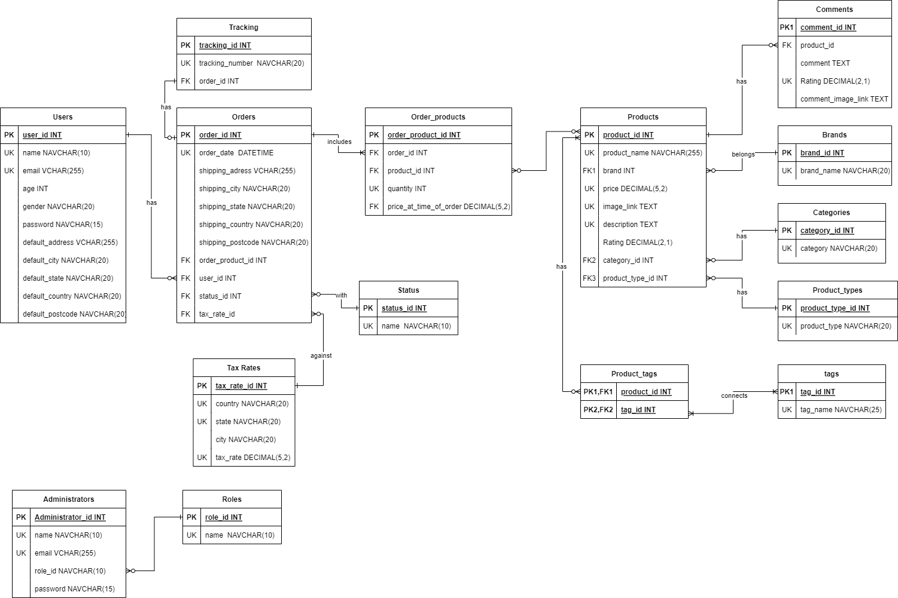

# Full_stack_web_final_project
## Description of the E-commerce Site
### Business Name
Glamorize Me - The Online Makeup Store
### Business Overview
Glamour Haven is a dedicated makeup store with a vibrant and skilled team of 20 beauty enthusiasts. With a legacy spanning 5 years, we have solidified our presence as a retail cornerstone in the beauty industry. Our commitment to quality and customer satisfaction has made us a trusted provider of a wide range of makeup products, catering to a diverse clientele seeking to enhance their beauty routines.
#### Product Range
Our product lineup encompasses an extensive variety of makeup items, including foundations, lipsticks, eyeshadows, and more, sourced from renowned brands known for their excellence and sustainability.
#### Sales Channel
Until now, our products have been available exclusively through our brick-and-mortar retail store, which has become a local favorite due to our personalized customer service and expert product curation.
#### Target Demographic
The online store is envisioned to cater to makeup aficionados ranging from amateurs to professional artists, predominantly within the age group of 18-45 who are tech-savvy and seek the convenience of online shopping. Our aim is to provide them with an unparalleled online shopping experience that matches the sophistication and personal touch of our physical store.
Database Structure Description

Our proposed database is meticulously designed to support the operational needs of Glamour Haven’s online storefront. It is crafted to handle intricate data relationships, ensure transactional efficiency, and enhance the customer experience through a robust and scalable structure.

### Database Structure Description
####  Table Names and Descriptions
1.	Users: Contains customer information. Essential for personalizing the shopping experience and managing orders.
2.	Administrators: Stores data on system administrators. Critical for system maintenance and management.
3.	Products: Catalog of all makeup products. The core of the online store showcasing items for sale.
4.	Orders: Records all customer orders. Necessary for tracking sales and managing order fulfillment.
5.	Order_products: Associates products with orders and includes purchase quantities. Vital for inventory management and order details.
6.	Tracking: Tracks the shipping progress of orders. Provides customers and business with shipping updates.
7.	Status: Lists possible statuses of an order. Helps in tracking order progress and customer service.
8.	Comments: Stores customer feedback on products. Important for community engagement and product quality feedback.
9.	Brands: Details of makeup brands. Allows customers to shop by their preferred brands.
10.	Categories: Classification of products into categories. Enables easier navigation and filtering of products.
11.	Product_types: Defines the types of makeup products. Further refines product categorization.
12.	Product_tags: Labels products with specific tags. Used for SEO and more refined product searches.
13.	Tags: Contains unique tags for categorization. Assists in detailed product labeling and search optimization.
14.	Roles: Identifies roles for system users. Key for access control and administrative purposes.
15.	Tax Rates: Holds the tax information based on geographical location, vital for accurately calculating tax applicable to orders.
#### Associations
•	Users to Orders: A one-to-many relationship. Each user can have multiple orders.
•	Orders to Order_products: A one-to-many relationship. Each order can contain multiple products.
•	Products to Order_products: A many-to-many relationship through Order_products. Products can be in many orders and orders can contain many products.
•	Orders to Tracking: A one-to-one relationship. Each order has one tracking number.
•	Products to Comments: A one-to-many relationship. Each product can have multiple comments.
•	Products to Brands, Categories, and Product_types: A many-to-one relationship. A product is associated with one brand, one category, and one product type.
•	Product_tags to Products and Tags: A many-to-many relationship. Products can have multiple tags and tags can be associated with multiple products.
•	Orders to Tax Rates: A many-to-one relationship, where each order is associated with a specific tax rate determined by geographical data.
#### ERD Inclusion
Attached within this proposal document is the Entity Relationship Diagram (ERD) which visually represents the database structure and the relationships between the tables, including their columns and associated data types.

